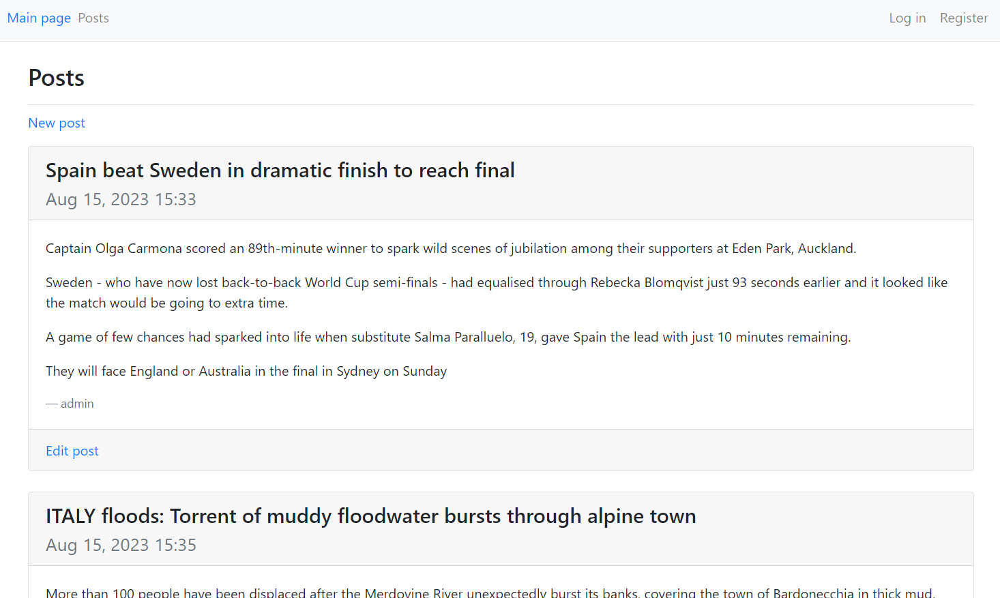

### Blog Django

В проекте реализован простой блог с использованием фреймворка Django. Отображение реализовано с помощью шаблонов и Bootstrap. Также реализаовано REST API с помощью Django REST Framework. Для тестирования API использовался Postman (для передачи access-токена в HTTP header для операций, где требуется авторизация).

Основное приложение (blogs_app) поддерживает следующие действия.

Операции                 |   Ограничения
-------------------------|---------------------------------
Просмотр всех постов     | Отсутствуют (авторизация не требуется)
Создание поста           | Требуется авторизация
Редактирование поста     |  Требуется авторизация + Пользователь должен быть владельцем поста
Удаление поста           | Требуется авторизация + Пользователь должен быть владельцем поста  

Все операции, кроме просмотра всех постов, требуют авторизации (декоратор @login_required). Изменение и удаление поста доступно только авторам поста.

Функциональность, относящаяся к работе с пользователями (регистрация, логин, логаут) вынесена в отдельное приложение (users).  

REST API вынесено в отдельный пакет (api), в котором реализованы все CRUD-операции с постами (с такими же ограничениями, что представлены в таблице выше), а также регистрация и аутентификация пользователей.  
Для аутентификации используется simple-jwt: access-токен со временем жизни 5 минут, refresh-токен со временем жизни 1 день, использование blacklist after rotation для избежания повторного использования refresh-токена.  
Следовательно через API доступно получение токенов (при вводе валидных логин-пароля) а также обновление токенов с помощью refresh-токена, которые в дальнейшем помещаются в HTTP header ('Authorization': 'Bearer {access-token}') для тех операций, где требуется авторизация.

